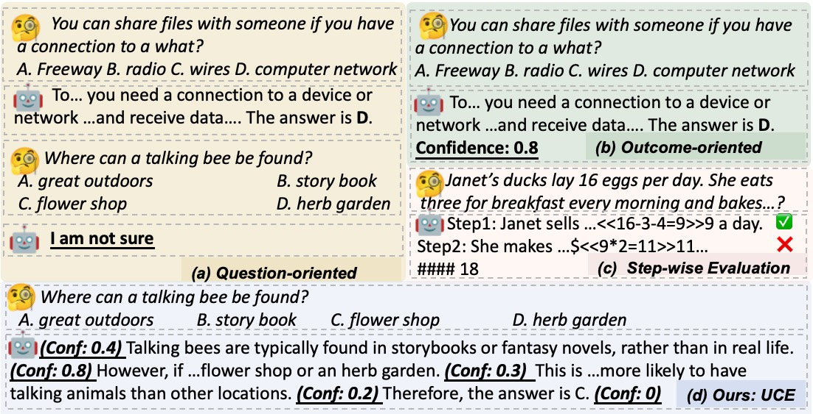

# UCE

Unified Condidence Esitmation (UCE)  provides the accurate and continuous confidence estimates throughout the generation process of an LLM. It is also a universal method that offers confidence estimates for any given text sequence.

* we develop a pipeline to construct training data to capture the inherent certainty of LLMs, and design data formats for three different scenarios to improve the generalization capability of LLM confidence estimation.
* we propose the Reverse Confidence Integration strategy, which integrates confidence scores from subsequent text sequences to provide a more accurate and holistic confidence estimation for the current text sequence.



# Training Data

1. we provide the training data on the GSM8K, CSQA and TrivalQA dataset, you can find on the fold `/data/UCE-data/XX/confData. The file LlaMA-7B.json is generated by LLama27b`
2. you also can construt the  confidence estimation data on other tasks or using other base models using:

   ```
   cd /methods/UCE/construct_data
   python construct_data_uce.py
   ```

# Training and Inference

We have tried two training skills: ift and multi-class, and you can find the details in the paper. For ift, we recommend you to use the  [llama-factory](l)

After training, please run the following code to obtain the response or the confidence estimate:

```
cd /methods/UCE/infer
python infer_answer_and_conf.py \
	--model_path model_ckp \
	--data_path test_data_path \
	--response_mode conf \ # you must choose a generation mode. "normal" mode requires the LLM to give a response for the given question, and the "conf" mode requires the LLM to provide the confidence estimate given the {question, response} pair
```

# The Baselines

We also provide the code of several popular confidence estimation methods. you can find on `/methods`

* P(IK): It trains a logistic regression with the additional value ``head" added to the model to output the confidence estimated. [[Language Models (Mostly) Know What They Know]](https://arxiv.org/abs/2207.05221)
* First-Prob: It uses the logits of the first token of LLM's generated answer as the confidence estimate.  [[Whose Opinions Do Language Models Reflect?]](https://arxiv.org/abs/2303.17548)
* SuC:  It first clusters the sub-questions, and use the same confidence estimate for questions in the same cluster. [[Teaching models to express their uncertainty in words]](https://arxiv.org/abs/2205.14334)
* Verb:  It is a prompt-based method. It designs the prompts to guide the model to output its confidence score alongside with the generated answer. [[Just Ask for Calibration: Strategies for Eliciting Calibrated Confidence Scores from Language Models Fine-Tuned with Human Feedback]](https://arxiv.org/abs/2305.14975)
* Fidelity: For MCQA, it decomposes the LLM confidence into the \emph{Uncertainty} about the question and the \emph{Fidelity} to the answer generated by LLMs. [[Calibrating the Confidence of Large Language Models by Eliciting Fidelity]](https://arxiv.org/abs/2404.02655)
* LECO: It also proposes leveraging logits to estimate step confidence. Besides, it further designs three logit-based scores that comprehensively evaluate confidence from both intra- and inter-step perspectives. [ [Learning From Correctness Without Prompting Makes LLM Efficient Reasoner]](https://arxiv.org/abs/2403.19094)
* Multi-Step: It also uses prompts to guide the model to output the process confidence and takes the average as the final result. [[Can llms express their uncertainty? an empirical evaluation of confidence elicitation in llms]](https://arxiv.org/abs/2306.13063)
